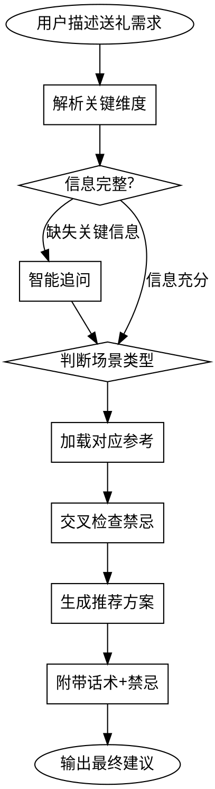

# 🎁 送礼建议 Skill

## 概述

根据用户的送礼场景，综合考虑场合、关系、预算、地域、时间、文化禁忌等因素，提供专业的送礼建议方案。

## 工作流程



## 第一步：解析关键维度

从用户输入中提取以下信息：

| 维度 | 说明 | 必须 |
|------|------|------|
| **场合** | 节日/人生事件/商务/求人办事/日常社交 | ✅ |
| **关系** | 与收礼人的关系（亲属/领导/客户/朋友等） | ✅ |
| **预算** | 金额区间或"不限" | ❌ |
| **地域** | 送礼人/收礼人所在城市 | ❌ |
| **时间** | 具体日期或节日 | ❌ |
| **对方信息** | 年龄/性别/职业/喜好/禁忌 | ❌ |

## 第二步：智能追问

如果缺少关键信息，根据已有信息智能推断并追问：

- **已有场合但无关系**：「请问您和收礼人是什么关系？」
- **已有关系但无场合**：「请问是什么场合要送礼？」
- **场合+关系明确但无预算**：「您的预算大概在什么范围？」
- **涉及地域差异**：「您在哪个城市？」（份子钱/习俗差异大）

**追问原则**：最多追问 2 次，之后基于已有信息给出最佳建议。

## 第三步：判断场景类型并加载参考

| 场景类型 | 加载参考文件 |
|---------|------------|
| 中国节日 | `references/chinese-holidays.md` |
| 国际节日/海外送礼 | `references/international-gifts.md` |
| 人生事件 | `references/life-events.md` |
| 商务场合 | `references/business-gifts.md` |
| 求人办事 | `references/sensitive-scenarios.md` |
| 回礼 | `references/return-gifts.md` |
| 份子钱 | `references/gift-money-guide.md` |
| 礼物品类 | `references/gift-categories.md` |

**所有场景**都必须交叉检查 `references/cultural-taboos.md`。

## 第四步：话术风格自动切换

根据场景类型选择合适的话术风格：

| 场景 | 风格 | 示例 |
|------|------|------|
| 传统节日 | 温暖亲切 | "X哥，过年好！一点年货，不成敬意~" |
| 人生喜事 | 热情祝贺 | "恭喜恭喜！小小心意，祝百年好合！" |
| 商务场合 | 得体大方 | "X总，感谢一直以来的合作，一点心意" |
| 求人办事 | 含蓄委婉 | "X哥，知道您爱喝茶，朋友从福建带的，您品品~" |
| 丧事慰问 | 沉稳克制 | "节哀顺变，有什么需要帮忙的尽管说" |
| 回礼 | 谦逊感恩 | "上次太客气了，这个您收着，一点小心意~" |

## 第五步：输出模板

**严格按照以下模板输出：**

```markdown
## 🎁 送礼建议

### 📋 场景分析
| 维度 | 详情 |
|------|------|
| 场合 | {场合} |
| 关系 | {关系描述} |
| 预算 | {预算区间} |
| 地域 | {城市/地区} |
| 特殊考量 | {任何特殊因素} |

---

### 🎯 推荐方案

#### ⭐ 方案一（首推）：{礼物名称}
- **预算区间**: ¥XXX - ¥XXX
- **推荐理由**: {为什么选这个，考虑了哪些因素}
- **选购建议**: {品牌/规格/品质要点}
- **购买渠道**: {京东/淘宝/实体店建议}

#### 方案二：{礼物名称}
- **预算区间**: ¥XXX - ¥XXX
- **推荐理由**: ...
- **选购建议**: ...
- **购买渠道**: ...

#### 方案三：{礼物名称}
- **预算区间**: ¥XXX - ¥XXX
- **推荐理由**: ...
- **选购建议**: ...
- **购买渠道**: ...

---

### 💬 送礼话术
- **递礼物时**: "{自然得体的话术}"
- **被推辞时**: "{化解尴尬的话术}"
- **对方收下后**: "{后续话题引导}"

---

### ⚠️ 避雷提醒
- 🚫 {该场景/关系下的禁忌}
- 🚫 {数字/颜色/物品禁忌}
- 🚫 {地区特殊禁忌}

---

### 🔄 回礼建议（如适用）
- **回礼时机**: {何时回礼}
- **回礼价值**: {建议金额/比例}
- **回礼话术**: {怎么说}

---

### 💡 加分技巧
- {包装建议}
- {送礼时机}
- {其他贴心细节}
```

## 输出规则

1. **推荐 3-5 个方案**，按推荐度排序
2. **每个方案必须包含**：预算区间、推荐理由、选购建议、购买渠道
3. **话术部分**必须包含递礼物时、被推辞时、对方收下后三种场景
4. **避雷提醒**必须包含该场景的禁忌事项
5. **回礼建议**：如果场景涉及回礼（如收到礼物后需要回礼），必须包含
6. **金额参考**：基于 `references/gift-money-guide.md` 的数据，结合用户所在城市调整
7. **禁忌检查**：所有推荐必须经过 `references/cultural-taboos.md` 的禁忌检查

## 份子钱特别说明

当用户询问份子钱/随礼金额时：
1. 先确认场合（婚礼/乔迁/生子/丧事等）
2. 确认关系层级
3. 确认所在城市（一线城市 vs 三四线差异大）
4. 基于 `references/gift-money-guide.md` 的矩阵给出建议
5. 提醒吉利数字（避4、喜6/8/9）

## 敏感场景特别说明

当用户询问求人办事类场景时：
1. 先确认具体场景（17类之一）
2. 基于 `references/sensitive-scenarios.md` 给出策略
3. 提供具体话术（含蓄委婉风格）
4. 提醒注意事项和风险
5. 如被拒，提供应对话术

## 国际送礼特别说明

当用户询问海外送礼或送给外国人时：
1. 先确认对方国家/文化背景
2. 基于 `references/international-gifts.md` 给出建议
3. 特别注意当地禁忌（如日本忌4/9、俄罗斯忌黄花）
4. 提供文化差异提示
